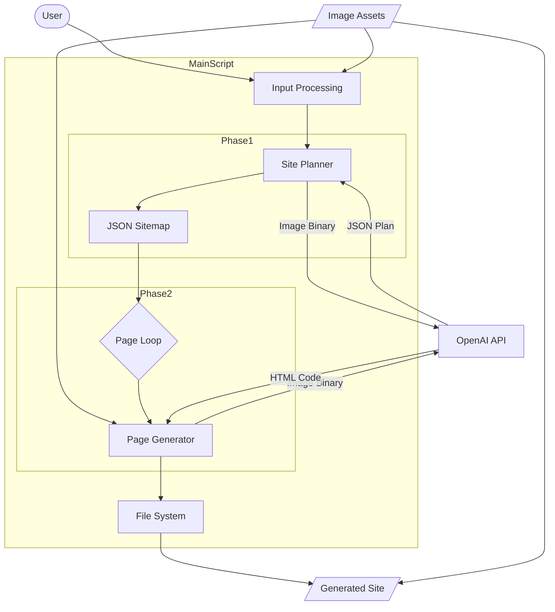

# System Architecture

```mermaid
graph TD
    User([User])
    Images[/Image Assets/]
    OpenAI[OpenAI API]
    
    subgraph MainScript
        Input[Input Processing]
        
        subgraph Phase1
            Planner[Site Planner]
            Sitemap[JSON Sitemap]
        end
        
        subgraph Phase2
            PageLoop{Page Loop}
            Generator[Page Generator]
        end
        
        FS[File System]
    end
    
    Output[/Generated Site/]

    User --> Input
    Images --> Input
    
    Input --> Planner
    Planner -- "Image Binary" --> OpenAI
    OpenAI -- "JSON Plan" --> Planner
    Planner --> Sitemap
    
    Sitemap --> PageLoop
    Images --> Generator
    
    PageLoop --> Generator
    Generator -- "Image Binary" --> OpenAI
    OpenAI -- "HTML Code" --> Generator
    Generator --> FS
    
    FS --> Output
    Images --> Output
```
