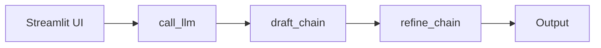
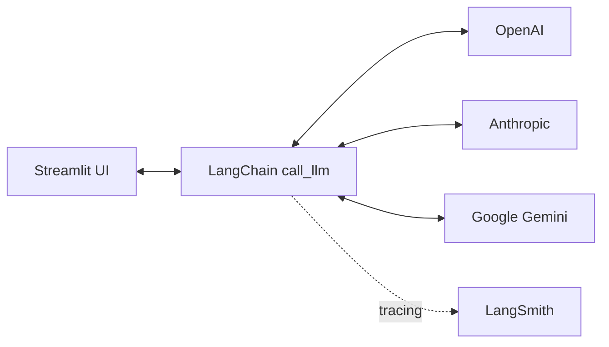

# LangSmith + LLM App

LangSmith のトレースと LLM 呼び出しの動作確認用の小さなサンプルです。  
Streamlit UI からプロンプト入力・API/モデル選択・実行ができます。

## 必要条件
- Python 3.10+

## セットアップ
```bash
python -m venv .venv
source .venv/bin/activate
pip install -r requirements.txt
```

`.env.example` をコピーして `.env` を作成し、以下を設定してください。
```
LANGSMITH_API_KEY=...
LANGSMITH_PROJECT_NAME=...   # 任意
LANGSMITH_ENDPOINT=...       # 任意（未設定なら https://api.smith.langchain.com）
LANGSMITH_TRACING=true       # 任意（false でトレース無効）
GEMINI_API_KEY=...
OPENAI_API_KEY=...           # OpenAI を使う場合
ANTHROPIC_API_KEY=...        # Anthropic を使う場合
```

## 実行（CLI）
```bash
python main.py
```

## 実行（Streamlit）
```bash
streamlit run app.py
```

## 補足
- LangChain 統一インターフェースで OpenAI / Anthropic / Gemini を呼び出します。
- LangSmith のトレースは自動有効化され、`invoke()` の run が記録されます。
- チェーンは「回答作成 → 整形（要点/詳細）」の2段構成です。

## トレースについて
- Flow（Mermaid）

- Run に metadata/tags が付与され、API/モデルが追跡できます。

## システム構成図

