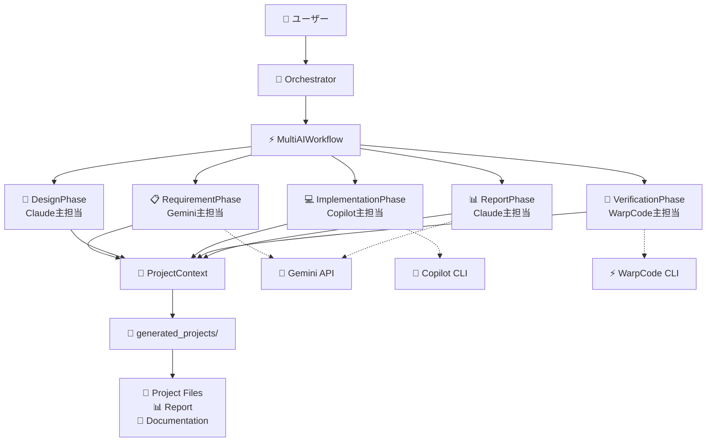
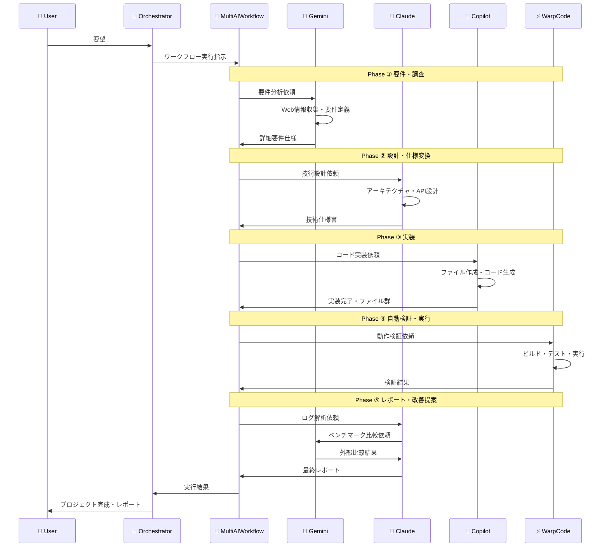

# 🤖 Multi-AI Cooperation System

複数のAIエージェント（Gemini, Claude, Copilot, WarpCode）を協調的に動かすオーケストレーションシステム

## 🧩 システム概要

このシステムは、異なるAIエージェントがそれぞれの専門性を活かして協調し、ユーザーからリクエストのあったプログラムを生成します。

## 📋 協調フローパターン

各AIエージェントが以下の役割で協調動作します：

| フェーズ | 主担当 | 補助 | 内容 |
|---------|-------|------|------|
| ① 要件・調査 | **Gemini** | Claude Code | Web/API/設計情報を収集し、詳細な要件分析 |
| ② 設計・仕様変換 | **Claude Code** | Gemini | 要件を技術仕様・クラス構成・API設計に変換 |
| ③ 実装 | **Copilot** | Claude Code | 設計に基づいてコード実装 |
| ④ 検証・実行 | **WarpCode** | Claude Code | ビルド・テスト・Lint実行による品質確認 |
| ⑤ レポート・改善提案 | **Claude Code** | Gemini | 実行ログ解析・外部ベンチマーク比較・改善提案 |

## 🔄 システムアーキテクチャ



## 🏗️ ディレクトリ構造

```
multi_ai_cooperation/
├── 📁 phases/                    # フェーズクラス群
│   ├── context.py               # 共通コンテキスト
│   ├── base_phase.py            # ベースフェーズクラス
│   ├── requirement_phase.py     # ①要件・調査フェーズ
│   ├── design_phase.py          # ②設計・仕様変換フェーズ
│   ├── implementation_phase.py  # ③実装フェーズ
│   ├── verification_phase.py    # ④自動検証・実行フェーズ
│   └── report_phase.py          # ⑤レポート・改善提案フェーズ
├── 📁 workflows/                # ワークフロー管理
│   └── multi_ai_workflow.py     # Multi-AI協調フロー制御
├── 📁 copilot/                  # Copilotエージェント
│   └── copilot.py
├── 📁 gemini/                   # Geminiエージェント
│   └── gemini.py
├── 📁 openai_agent/             # OpenAIエージェント
│   └── openai_app.py
├── 📁 warpcode/                 # WarpCodeエージェント
│   └── warpcode.py
├── 📁 generated_projects/       # 生成されたプロジェクト保存先
├── orchestrator.py              # オーケストレーター。ユーザー入力を受け付けるエントリーポイント
└── requirements.txt             # 依存関係を定義
```

## 🔄 協調実行フロー



## 🚀 使用方法

### 1. 環境セットアップ

```bash
# Python仮想環境を作成
python -m venv venv

# 仮想環境をアクティベート
# Windows:
venv\Scripts\activate
# macOS/Linux:
source venv/bin/activate

# 依存関係インストール
pip install -r requirements.txt

# 環境変数設定（.envファイル作成）
GOOGLE_API_KEY=your_gemini_api_key
OPENAI_API_KEY=your_openai_api_key
```

### 2. システム実行

```bash
# 仮想環境がアクティベートされていることを確認
# (venv) が表示されていない場合は、以下を実行:
# Windows: venv\Scripts\activate
# macOS/Linux: source venv/bin/activate

# メインシステム起動
python orchestrator.py

# 設定選択
⚙️ システム設定
==============================
📄 詳細表示モード (各フェーズの内容を詳しく表示) [y/N]: y
```

### 3. 使用例

```bash
💬 実行したいタスクを入力してください: Node.jsでREST APIサーバーを作成して

🎯 タスク開始: Node.jsでREST APIサーバーを作成して  
🤖 AI協調フロー: Gemini → Claude → Copilot → WarpCode → Claude
🔍 詳細表示モードで実行中...
======================================================================

🔄 Phase 1/5: REQUIREMENT - 実行中...
   📋 Geminiが要件分析・情報収集を実行中...
   ・・・・・・・・・・・・・・・・・・・・
✅ Phase 1 完了: requirement

📄 REQUIREMENTフェーズ詳細結果:
   🔍 Gemini分析結果 (抜粋):
   ## 機能要件
   - RESTful API設計
   - CRUD操作サポート
   - JSON形式レスポンス
   ... (続きあり、総35行)

   📋 要件分析完了
──────────────────────────────────────────────────────────────────────

🔄 Phase 2/5: DESIGN - 実行中...  
   📐 Claude Codeが技術設計・仕様変換を実行中...
   ・・・・・・・・・・・・・・・・・・・・
✅ Phase 2 完了: design
   📐 技術設計完了

🔄 Phase 3/5: IMPLEMENTATION - 実行中...
   💻 Copilotが実装・コード生成を実行中...
   ・・・・・・・・・・・・・・・・・・・・
✅ Phase 3 完了: implementation
   💻 実装完了: 5 ファイル作成
   📁 保存先: generated_projects/20241104_123456_Node_js_API

🔄 Phase 4/5: VERIFICATION - 実行中...
   🧪 WarpCodeが自動検証・実行テストを実行中...
   ・・・・・・・・・・・・・・・・・・・・
✅ Phase 4 完了: verification  
   🧪 検証完了: 3 テスト実行 - 全テスト成功

🔄 Phase 5/5: REPORT - 実行中...
   📊 Claude Codeがレポート・改善提案を生成中...
   ・・・・・・・・・・・・・・・・・・・・
✅ Phase 5 完了: report
   📊 プロジェクトレポート生成完了

======================================================================
🎉 Multi-AI協調ワークフロー完了
🎯 総合成功率: 100.0%
```

## 📁 生成されるプロジェクト構造

各実行で以下の構造でプロジェクトが生成されます：

```
generated_projects/20241104_123456_Node_js_REST_API/
├── 📄 server.js              # Copilot作成 - メインサーバー
├── 📄 routes/                # Copilot作成 - ルーティング
├── 📄 package.json           # Copilot作成 - 依存関係
├── 📄 README.md              # Copilot作成 - プロジェクト説明
└── 📊 PROJECT_REPORT.md      # システム作成 - 詳細レポート
```

## 🎯 主要特徴

### ✨ AI協調最適化
- 各AIエージェントの専門性を最大活用
- フェーズ間でのコンテキスト共有
- 失敗時の適切なエラーハンドリング

### 🏗️ モジュラー設計
- 各フェーズが独立したモジュール
- 新しいフェーズの簡単な追加
- テスタビリティの向上

### 🌐 言語非依存
- Python, JavaScript, Java, Go, Rust等に対応
- 要件に応じた最適な技術スタック選択
- フレームワーク・ライブラリの自動選定

### 📊 詳細レポーティング
- 各フェーズの実行結果記録
- 外部ベンチマークとの比較
- 改善提案・学習リソース提供

### 🔍 詳細進行表示
- 標準表示モード：概要とサマリー
- 詳細表示モード：各フェーズの内容詳細
- 実行中の設定変更サポート

## 🛠️ 開発・デバッグ支援

### フェーズ単体実行

```bash
# 仮想環境をアクティベート（未実行の場合）
# Windows: venv\Scripts\activate
# macOS/Linux: source venv/bin/activate

# 各フェーズを個別にテスト
python -m phases.requirement_phase      # 要件分析テスト
python -m phases.design_phase           # 設計テスト  
python -m phases.implementation_phase   # 実装テスト
python -m phases.verification_phase     # 検証テスト
python -m phases.report_phase           # レポート生成テスト
```

### カスタムフェーズの追加

```python
from phases.base_phase import SyncPhase
from phases.context import ProjectContext

class CustomPhase(SyncPhase):
    def __init__(self):
        super().__init__("custom")
    
    def execute_sync(self, context: ProjectContext):
        # カスタムロジック実装
        result = {"custom_completed": True}
        self.save_result(context, result)
        return result

# ワークフローに追加
from workflows.multi_ai_workflow import WorkflowBuilder

workflow = WorkflowBuilder().add_phase(CustomPhase()).build()
```

## 📈 パフォーマンス指標

- **要件分析精度**: Geminiの広範な知識活用
- **設計品質**: Claude Codeの構造化思考
- **実装速度**: Copilotの高速コード生成
- **検証網羅性**: WarpCodeの自動テスト実行
- **レポート詳細度**: 複合的なAI分析結果

---
