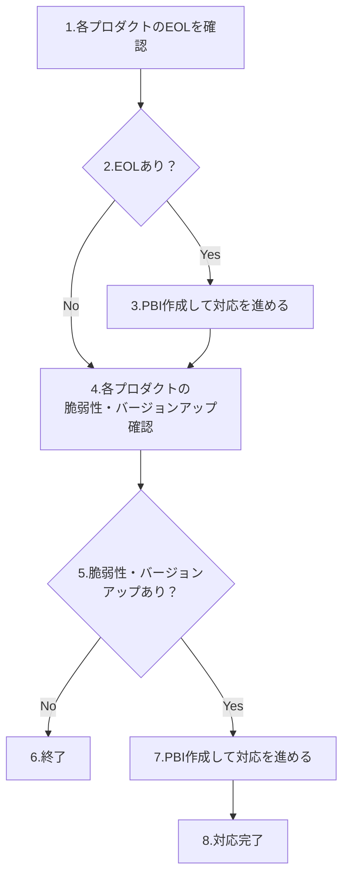

```mermaid
flowchart TD
    A[1.各プロダクトのEOLを確認] --> B{2.EOLあり？}
    B --> |No| C[4.各プロダクトの
    脆弱性・バージョンアップ
    確認]
    B --> |Yes| D[3.PBI作成して対応を進める]
    D --> C
    C --> E{5.脆弱性・バージョン
    アップあり？}
    E --> |No| F[6.終了]
    E --> |Yes| G[7.PBI作成して対応を進める]
    G --> H[8.対応完了]
```
