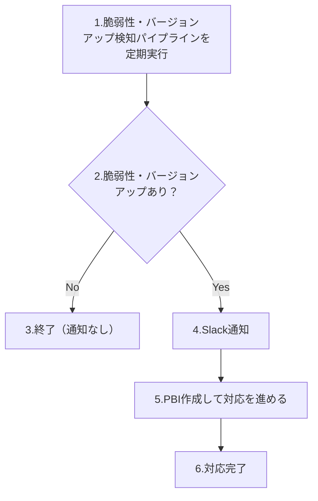

```mermaid
flowchart TD
    A[1.脆弱性・バージョン
    アップ検知パイプラインを
    定期実行] --> B{2.脆弱性・バージョン
    アップあり？}
    B --> |No| C[3.終了（通知なし）]
    B --> |Yes| D[4.Slack通知]
    D --> E[5.PBI作成して対応を進める]
    E --> F[6.対応完了]
```
