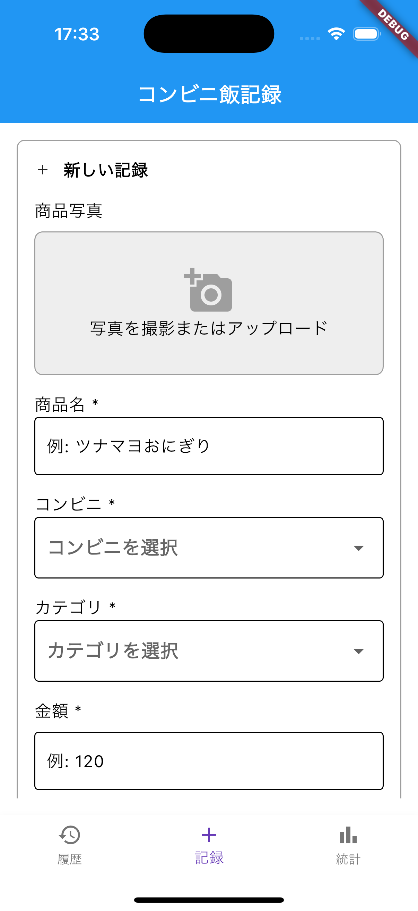
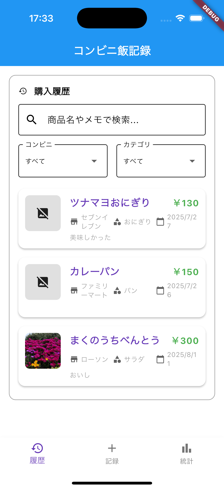
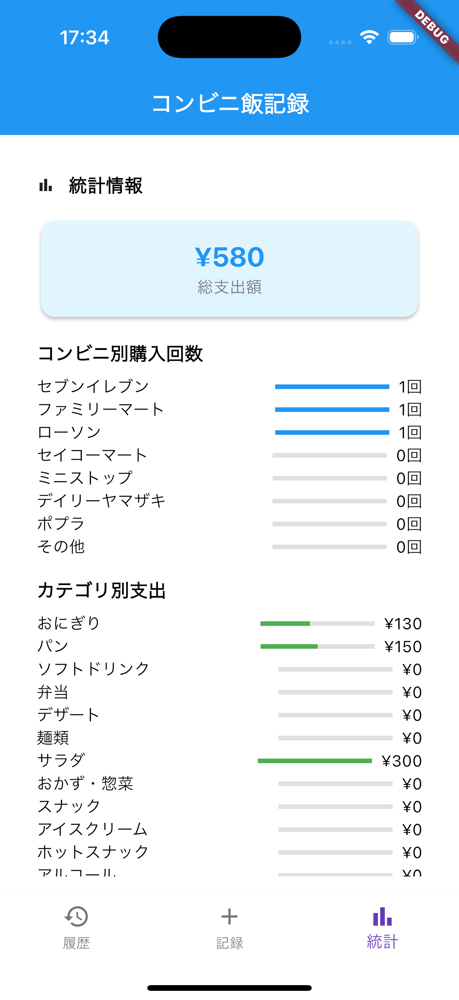

# コンビニ飯記録アプリ

## 対応OS
- iOS
- Android

## 機能一覧
- 記録画面:購入したコンビニの商品（おにぎり、パン、デザートなど）を写真と簡単なメモ、金額とともに記録。
- 履歴画面:記録した商品の履歴を一覧で表示。商品名や購入日などで検索・フィルタリングできる。
- 統計画面:記録したデータから、コンビニごとの購入回数や、ジャンル別の支出などをグラフで表示

## 使用技術、FW、LB
- Flutter & Dart: メイン言語
- flutter_localization: メッセージ管理
- go_router: 画面遷移
- Riverpod: 状態管理
- minio: クラウドStogageオブジェクト保存処理
- supabase_flutter: Supabase関連処理

## セットアップ手順

1. リポジトリをクローン
	```sh
	git clone <このリポジトリのURL>
	cd convenience_store_food_record_app
	```
2. 依存パッケージを取得
	```sh
	flutter pub get
	```
3. iOSの場合
	```sh
	cd ios && pod install && cd ..
	```
4. アプリを起動
	```sh
	flutter run
	```

## スクリーンショット

| 記録画面 | 履歴画面 | 統計画面 |
|:---:|:---:|:---:|
|  |  |  |

## API,DB,Storage仕様

- データ登録,取得API: Supabase REST API
- データ登録先Table: Supabase Table（PURCHASE_HISTORY）
- 画像アップロードStorage: Cloudflare R2

## 開発者向けメモ

- DBスキーマやサンプルデータは `docs/` 配下のSQLファイルを参照
- UI部品は `lib/components/`、画面ごとのWidgetは `lib/screen/` に配置
- 状態管理はRiverpodを利用
- ローカライズは `lib/l10n/` 配下