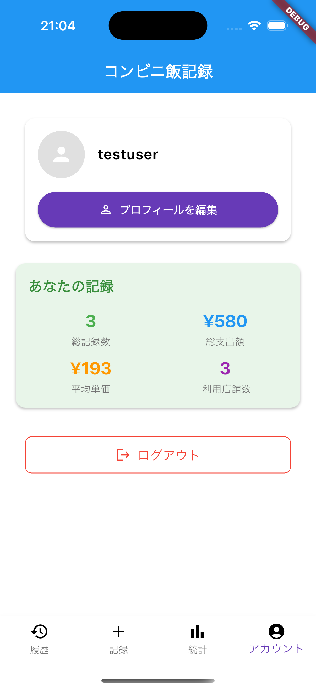

# コンビニ飯記録アプリ 🍱

Flutter で開発した、**コンビニで購入した商品の記録・履歴・統計を簡単に管理できるアプリ**です。  
日々の支出や食生活を“見える化”して、自分の「コンビニ習慣」を振り返ることができます。

---

## 🚀 対応OS
- iOS
- Android

---

## 📱 機能一覧

### 📝 記録画面
- 購入した商品（おにぎり、パン、デザートなど）を  
  - 写真  
  - 簡単なメモ  
  - 金額  
  とともに記録  
- 画像サイズの自動リサイズ処理あり（通信・容量対策）  
- 1日のアップロード件数制限あり（スパム防止）  

### 📚 履歴画面
- 記録した商品の履歴を一覧で表示  
- 商品名、カテゴリ、店舗などで検索・フィルタリング可能  
- 編集・削除対応（予定）

### 📊 統計画面
- コンビニ別の購入回数・支出額をグラフ表示  
- ジャンル別支出割合を円グラフ・棒グラフで可視化  
- 集計期間の切り替え（週・月）に対応予定  

### 👤 マイページ
- ユーザー情報（ニックネーム・メールアドレス）を表示  
- 端末ごとの識別IDを取得し、Supabase Auth と連携  
- ログアウト・再ログインが可能  
- 今後のアップデートで、通知設定やテーマ変更などの個人設定にも対応予定  


---

## スクリーンショット

| 記録画面 | 履歴画面 | 統計画面 | マイページ |
|:---:|:---:|:---:|:---:|
|  |  |  |  |

---

## 🧩 使用技術 / フレームワーク

| 分類 | 内容 |
|------|------|
| フロントエンド | Flutter & Dart |
| 状態管理 | Riverpod |
| ルーティング | go_router |
| ローカライズ | flutter_localization |
| バックエンド | Supabase（REST API + Edge Functions） |
| ストレージ | Cloudflare R2 + MinIO |
| グラフ描画 | charts_flutter（または fl_chart） |
| デバイス管理 | device_info_plus（端末ID取得など） |

---

## 🛠️ セットアップ手順

1. **リポジトリをクローン**
   ```bash
   git clone <このリポジトリのURL>
   cd convenience_store_food_record_app
