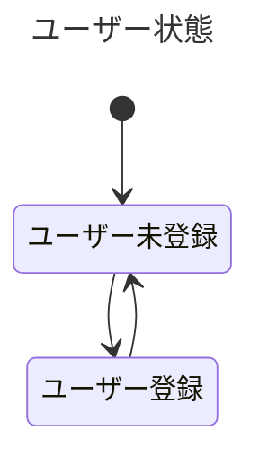

## ユーザーID管理 設計仕様

- ユーザー情報は `user` テーブルで管理します
- アカウント未登録の場合は、デバイスIDでユーザーを識別します
    - アプリ再インストールしても基本的には同一ユーザーを識別できる想定ですが完全ではないです
- アカウント登録後は、DBで採番されたID値（user_id）で管理します
    - デバイス変わっても引き続き使用可能

### 状態遷移図

