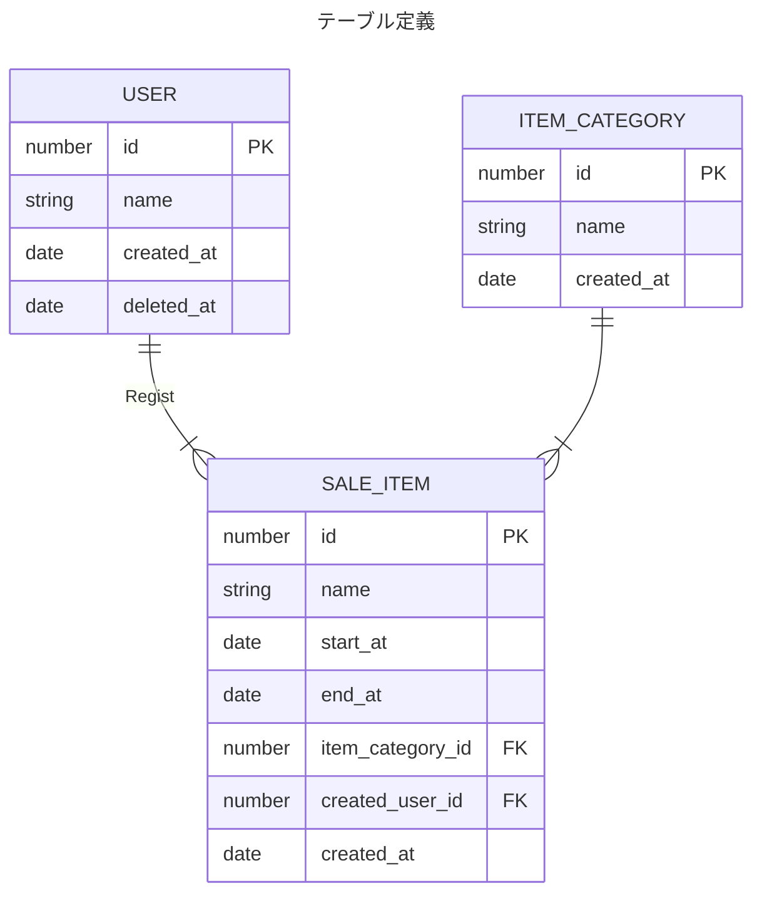

```mermaid
---
title: テーブル定義
---
erDiagram
    USER{
        number id PK
        string name
        date created_at
        date deleted_at
    }
    ITEM_CATEGORY {
        number id PK
        string name
        date created_at
    }
    SALE_ITEM {
        number id PK
        string name
        date start_at
        date end_at
        number item_category_id FK
        number created_user_id FK
        date created_at
    }
    USER ||--|{ SALE_ITEM: "Regist"
    ITEM_CATEGORY ||--|{ SALE_ITEM: ""
```
