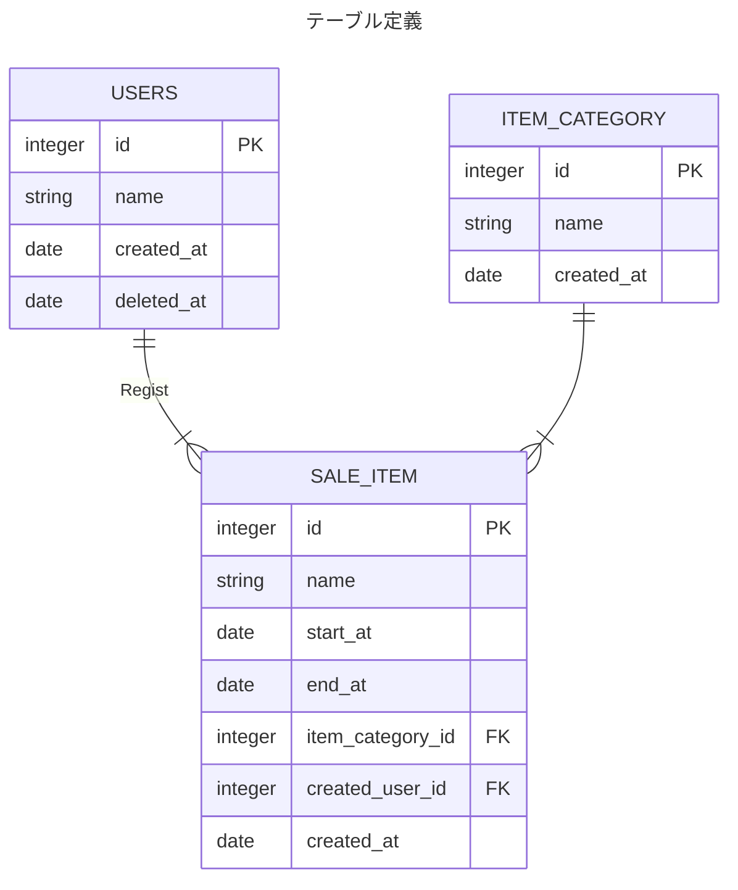

```mermaid
---
title: テーブル定義
---
erDiagram
    USERS{
        integer id PK
        string name
        date created_at
        date deleted_at
    }
    ITEM_CATEGORY {
        integer id PK
        string name
        date created_at
    }
    SALE_ITEM {
        integer id PK
        string name
        date start_at
        date end_at
        integer item_category_id FK
        integer created_user_id FK
        date created_at
    }
    USERS ||--|{ SALE_ITEM: "Regist"
    ITEM_CATEGORY ||--|{ SALE_ITEM: ""
```
